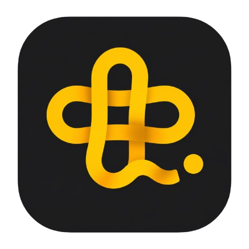

  

<h1 align="center">Privacy Policy</h1>

  <strong>Last updated:</strong> 30 April 2026

---

This Privacy Policy explains how **Sina Tech** collects, uses, stores, and protects personal information when you use **Waffli**, our task and productivity app.

Waffli is designed to help you manage tasks, plan your day, track productivity, and use optional features such as voice-based task capture.

We do **not** sell your personal data.  
We do **not** use your personal data for advertising.

---

## 1. Who We Are

Waffli is developed and operated by **Sina Tech**.

**Data Controller:**  
Sina Tech  
69 Skyline Place, Oxford Road  
Luton, Bedfordshire, LU1 3DQ  
United Kingdom  

**Email:** sinatechnologies@outlook.com  
**ICO registration number:** [add ICO registration number once available]

For the purposes of UK data protection law, Sina Tech is the data controller for the personal data processed through Waffli.

---

## 2. Information We Collect

We only collect information needed to provide, secure, improve, and support Waffli.

### 2.1 Account Information

When you create an account, we collect:

- Email address
- Display name
- Authentication identifiers created by our login provider

We use this information to create your account, identify you when you sign in, sync your data, provide support, and secure access to your account.

---

### 2.2 Task and Productivity Data

When you use Waffli, you may create or generate productivity-related content, including:

- Task titles
- Task notes
- Scheduled dates and times
- Categories or labels
- Task complexity
- Estimated duration
- Actual completion time
- Distraction counts
- Completion status
- Recurring task schedules
- Productivity statistics, such as streaks, completed task totals, and logged distractions

We use this information to provide Waffli’s core task management and productivity features.

---

### 2.3 Mood Entries

Waffli may allow you to record optional mood entries.

Mood entries are entirely optional. Because mood information may reveal information about your wellbeing, we treat this data with extra care. We use mood entries only to display your own history, trends, or productivity context inside the app.

Waffli is not a medical, therapy, diagnosis, or mental health service. Mood tracking is provided only as a personal productivity feature.

You can choose not to use mood tracking.

---

### 2.4 Voice and Audio: Brain Dump Feature

When you use the **Brain Dump** feature, your device microphone records an audio clip so that your spoken input can be converted into text.

The audio clip is transmitted over an encrypted connection to a secure server-side function, which forwards it to **Groq** for transcription. The resulting text is returned to Waffli so you can review it before any tasks are created.

Waffli does **not** permanently store your audio recordings. Audio is used only for transcription and is not used by Waffli for advertising.

Groq may process the audio and transcription data according to its own privacy, data processing, and retention terms. Where available and enabled, we use provider settings designed to reduce or prevent retention of transcription data.

---

### 2.5 App Preferences

We may store your app preferences so they can sync across devices or reinstalls, including:

- Accent colour
- Haptic feedback preference
- Sound preference
- Morning reminder setting
- Evening reminder setting
- Biometric lock preference

---

### 2.6 Subscription and Purchase Information

Subscription management is handled by **RevenueCat**.

We may receive:

- Your subscription status, such as Free, Pro, or Unlimited
- An app-specific or anonymised customer identifier
- Purchase entitlement status
- Subscription renewal or expiry information

We do **not** receive or store your full payment card details. Payments are processed by Apple, Google, or the relevant app store/payment provider.

---

### 2.7 Local Device Storage

Some information may be stored locally on your device, including:

- Monthly Brain Dump usage counters
- Temporary app state
- Local settings required for app functionality

Where local-only information is used, it remains on your device unless the app specifically syncs that information to your account.

---

### 2.8 Biometric Authentication

If you enable biometric lock, such as Face ID, Touch ID, or Android biometric authentication, authentication is handled by your device’s operating system.

Waffli does **not** receive, access, collect, or store your biometric data. We only store whether biometric lock is enabled as an app preference.

---

## 3. How We Use Your Information

We use your information to:

- Provide the Waffli app and its features
- Create and manage your account
- Sync your tasks, preferences, and subscription status
- Process Brain Dump transcription requests
- Display your productivity statistics
- Provide reminders and app settings
- Prevent misuse and protect the security of the app
- Respond to support requests
- Comply with legal obligations

We do **not** use your personal data for third-party advertising.

---

## 4. Lawful Basis for Processing

Where UK GDPR or GDPR applies, we rely on the following lawful bases:

| Purpose | Lawful basis |
|---|---|
| Creating and managing your account | Performance of a contract |
| Providing task management features | Performance of a contract |
| Syncing tasks, preferences, and productivity data | Performance of a contract |
| Processing Brain Dump audio for transcription | Performance of a contract and, where required, consent |
| Processing optional mood entries | Explicit consent, where required |
| Managing subscriptions | Performance of a contract |
| Security, fraud prevention, and service protection | Legitimate interests |
| Responding to support requests | Legitimate interests or performance of a contract |
| Legal or regulatory compliance | Legal obligation |

You can withdraw consent for optional features by not using those features or by deleting the relevant data where the app provides that option.

Withdrawing consent does not affect processing that happened before consent was withdrawn.

---

## 5. How Your Data Is Shared

We do not sell your personal data.

We share personal data only with service providers that help us operate Waffli. These providers process data on our behalf or provide services necessary for the app to function.

| Provider | Purpose |
|---|---|
| Supabase | Authentication, database hosting, server-side functions, and secure data storage |
| RevenueCat | Subscription and entitlement management |
| Groq | AI transcription for Brain Dump audio |
| Apple | App distribution, in-app purchases, payment processing, crash/reporting services where applicable |
| Google | App distribution, in-app purchases, payment processing, crash/reporting services where applicable |

These providers may process data according to their own privacy policies and data processing terms.

We may also disclose information if required by law, regulation, court order, or to protect the rights, safety, and security of Waffli, our users, or others.

---

## 6. International Transfers

Sina Tech is based in the United Kingdom. Some of our service providers may process personal data outside the UK or the European Economic Area.

Where personal data is transferred internationally, we rely on appropriate safeguards where required, such as adequacy regulations, standard contractual clauses, international data transfer agreements, or equivalent data protection mechanisms.

---

## 7. Data Storage and Security

Waffli uses technical and organisational measures designed to protect your personal data.

These include:

- Encrypted transmission using HTTPS/TLS
- Authentication controls
- Database access controls
- Row-level security rules where supported
- Server-side access restrictions
- Limited provider access based on operational need

No method of transmission or storage is completely secure, but we take reasonable steps to protect your information from unauthorised access, loss, misuse, alteration, or disclosure.

---

## 8. Data Retention

We keep your personal data for as long as your account remains active or as long as needed to provide Waffli.

If you delete your account through **Profile → Delete Account**, we will delete or anonymise personal data associated with your account, including:

- Account profile data
- Tasks
- Recurring task definitions
- Mood entries
- Productivity statistics
- App preferences

Some limited information may be retained for a short period where necessary for security, backup recovery, legal compliance, payment records, fraud prevention, or dispute resolution.

Backups and logs may take additional time to expire from our systems and service providers’ systems.

---

## 9. Your Rights

Depending on where you live, you may have rights over your personal data.

These may include the right to:

- Access the personal data we hold about you
- Correct inaccurate or incomplete data
- Delete your account and associated personal data
- Request a copy of your data
- Object to certain processing
- Restrict certain processing
- Withdraw consent where processing is based on consent
- Complain to a data protection authority

UK users may contact the **Information Commissioner’s Office**, the UK data protection regulator.

EU users may contact their local supervisory authority.

To exercise your rights, contact us at:

**sinatechnologies@outlook.com**

We may need to verify your identity before responding to certain requests.

---

## 10. California Privacy Rights

If you are a California resident, you may have rights under the California Consumer Privacy Act, as amended by the California Privacy Rights Act.

These may include the right to:

- Know what personal information we collect
- Know how we use and disclose personal information
- Request deletion of personal information
- Request correction of inaccurate personal information
- Request a copy of personal information
- Opt out of sale or sharing of personal information
- Not be discriminated against for exercising your privacy rights

Waffli does **not** sell personal information.

Waffli does **not** share personal information for cross-context behavioural advertising.

---

## 11. Children’s Privacy

Waffli is not directed at children.

You must not use Waffli if you are under 13 years old, or under the minimum age required by the laws of your country to use online services without parental consent.

We do not knowingly collect personal data from children below the applicable minimum age.

If you believe a child has provided personal data to Waffli, contact us at **sinatechnologies@outlook.com** and we will take appropriate steps to delete it.

---

## 12. App Store and Platform Providers

If you download Waffli through the Apple App Store or Google Play, Apple or Google may collect information under their own privacy policies.

In-app purchases and subscriptions are processed by the relevant app store or payment provider. We do not control the personal data collected by Apple or Google through their platforms.

---

## 13. Changes to This Privacy Policy

We may update this Privacy Policy from time to time.

If we make material changes, we will notify you in the app, by email, or by another appropriate method before the changes take effect where required by law.

The “Last updated” date at the top of this policy shows when it was last revised.

---

## 14. Contact Us

For questions, requests, or complaints about this Privacy Policy or how Waffli handles personal data, contact:

**Sina Tech**  
69 Skyline Place, Oxford Road  
Luton, Bedfordshire, LU1 3DQ  
United Kingdom  

**Email:** sinatechnologies@outlook.com  
**ICO registration number:** [add ICO registration number once available]

---

  

  © 2026 Sina Tech. All rights reserved.

